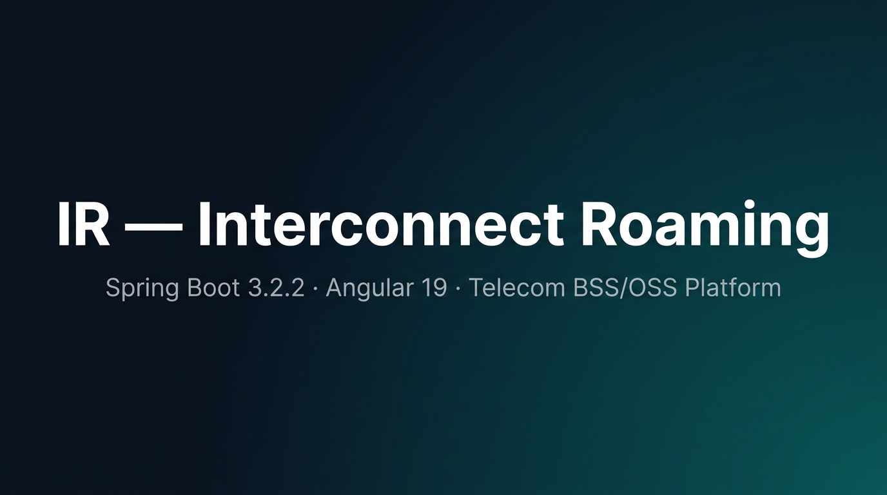

<div align="center">



<br/>


<br/>

**`Liquibase Auto-Migration`** &nbsp;·&nbsp; **`HikariCP Connection Pool`** &nbsp;·&nbsp; **`JWT Auth`** &nbsp;·&nbsp; **`Swagger UI`**

<br/>

</div>

---

## 📁 Repository Structure

```
IR/
├── ir-server/          ← Spring Boot Backend  (Port: 8060)
│   ├── src/
│   │   └── main/
│   │       ├── java/com/xcess/ocs/
│   │       └── resources/
│   │           ├── application.properties          ← Production config
│   │           ├── application-local.properties    ← Local dev config ✅
│   │           └── db/changelog/                   ← Liquibase migrations
│   ├── build.gradle
│   └── gradle/wrapper/gradle-wrapper.properties
│
├── ir-gui/             ← Angular Frontend  (Port: 4200)
│   ├── src/
│   │   ├── app/
│   │   └── environments/
│   │       ├── environment.ts          ← Local dev URLs ✅
│   │       └── environment.prod.ts
│   └── package.json
│
└── README.md
```

---

## 🔧 Tech Stack

| Layer | Technology | Version |
|---|---|---|
| **Backend** | Spring Boot | 3.2.2 |
| **Language** | Java | 21 LTS (Microsoft OpenJDK) |
| **Build Tool** | Gradle Wrapper | 8.14.3 |
| **Frontend** | Angular | 19.x |
| **Frontend Lang** | TypeScript | 5.x |
| **Database** | MySQL | 8.0 |
| **DB Migration** | Liquibase | 4.24.0 |
| **Messaging** | Apache Kafka | localhost:9092 |
| **Connection Pool** | HikariCP | 5.0.1 |
| **API Docs** | SpringDoc / Swagger | 3.x |

---

## 🚀 Local Development Setup

### Prerequisites

| Tool | Version Required | Notes |
|---|---|---|
| Java | **21 LTS** | ⚠️ Java 25 will NOT work — Gradle Groovy DSL incompatible |
| Node.js | 18+ | For Angular frontend |
| npm | 9+ | Package manager |
| MySQL | 8.0 | Running on port 3306 |
| Git | Latest | With Bitbucket credentials saved |

---

### Step 1 — Clone Repositories

```bash
# Create IR workspace folder
mkdir IR && cd IR

# Clone Backend (ir-server)
git clone --branch ocs-summary-engine_tap_merge-sms-error-processing \
  https://amin.sadique@bitbucket.org/keyannatechnology/ir-server.git ir-server

# Clone Frontend (ir-gui)
git clone --branch error-rerating-processing \
  https://amin.sadique@bitbucket.org/keyannatechnology/ir-gui.git ir-gui
```

> **Note:** `ir-gui` does not have the same branch as `ir-server`. Use `error-rerating-processing` for frontend.

---

### Step 2 — Java 21 Installation

> ⚠️ **Critical:** Java 25 is **NOT compatible** with Gradle 8.x Groovy DSL (`class file major version 69` error). You **must** use Java 21 LTS.

**Install via winget (Windows):**
```powershell
winget install --id Microsoft.OpenJDK.21 --silent --accept-package-agreements --accept-source-agreements
```

**Installed path:** `C:\Program Files\Microsoft\jdk-21.0.12.8-hotspot`

**Verify:**
```powershell
$env:JAVA_HOME = "C:\Program Files\Microsoft\jdk-21.0.12.8-hotspot"
java -version
# Expected: java version "21.0.12"
```

---

### Step 3 — Backend (ir-server) Configuration

#### 3a. Gradle Wrapper Upgrade

File: `ir-server/gradle/wrapper/gradle-wrapper.properties`

```properties
# Before (old — breaks with Java 25)
distributionUrl=https\://services.gradle.org/distributions/gradle-8.13-bin.zip

# After (fixed ✅)
distributionUrl=https\://services.gradle.org/distributions/gradle-8.14.3-bin.zip
```

#### 3b. Jacoco Fix (Java 25 Compatibility)

File: `ir-server/build.gradle`

```groovy
// Before (broken)
jacocoTestReport {
    dependsOn test
    reports {
        xml.required = true
        html.required = true
    }
}

// After (fixed ✅ — tasks.named style)
tasks.named('jacocoTestReport') {
    dependsOn test
    reports {
        xml.required = true
        html.required = true
    }
}
```

#### 3c. Local Properties — DB & Liquibase Config

File: `ir-server/src/main/resources/application-local.properties`

```properties
spring.application.name=ocs
server.port=8080

# MySQL — Local credentials
spring.datasource.url=jdbc:mysql://localhost:3306/xcessocs?allowPublicKeyRetrieval=true&useSSL=false&autoreconnect=true&createDatabaseIfNotExist=true
spring.datasource.username=root
spring.datasource.password=0721         # ← Updated from 'root' to '0721' ✅
spring.datasource.driver-class-name=com.mysql.cj.jdbc.Driver

# Liquibase
spring.liquibase.change-log=classpath:/db/changelog/db.changelog-master.xml
spring.liquibase.drop-first=false
spring.liquibase.clear-checksums=false  # ← Changed from true to false ✅
# Reason: On fresh DB, DATABASECHANGELOG table doesn't exist yet.
#         clear-checksums=true tries to UPDATE it and crashes.
```

> ⚠️ **Important:** Run with `--spring.profiles.active=local` to use this config.
> Without it, `application.properties` (with `password=root`) will load and cause `Access denied`.

---

### Step 4 — Run Backend

```powershell
cd ir-server

# Set JAVA_HOME to Java 21
$env:JAVA_HOME = "C:\Program Files\Microsoft\jdk-21.0.12.8-hotspot"
$env:SPRING_PROFILES_ACTIVE = "local"

# Run with local profile
.\gradlew.bat bootRun --args="--spring.profiles.active=local"
```

**Expected startup sequence:**
```log
The following 1 profile is active: "local"
HikariPool-1 - Start completed.
Running Changeset: db/changelog/db.changelog-initial.xml...
Table agreements created ✅
Table countries created ✅
... (all Liquibase migrations run automatically)
Started OcsApplication in X seconds ✅
```

---

### Step 5 — Frontend (ir-gui) Configuration

#### 5a. Install Dependencies

```bash
cd ir-gui

# Use --legacy-peer-deps
# (ng-apexcharts@1.17.1 requires Angular 20, project uses Angular 19)
npm install --legacy-peer-deps
```

#### 5b. Environment Config — Point to Localhost Backend

File: `ir-gui/src/environments/environment.ts`

```typescript
export const environment = {
  production: false,
  // LOCAL DEV - pointing to localhost backend ✅
  APIGATEWAY_IP_PORT: "http://localhost:8060",
  RATING_ENGINE_URL: "http://localhost:8060",
  // REMOTE (commented out for local dev)
  // APIGATEWAY_IP_PORT: "https://assistant.unifyxcess.ai:30443",
  // RATING_ENGINE_URL: "http://192.168.25.16:8060",
};
```

#### 5c. Start Angular Dev Server

```bash
npx ng serve --port 4200
```

**Expected output:**
```
Watch mode enabled. Watching for file changes...
  ➜  Local:   http://localhost:4200/
```

---

## 🌐 Access URLs (Local Dev)

| Service | URL | Notes |
|---|---|---|
| 🔵 **Frontend** | `http://localhost:4200` | Angular dev server |
| 🟠 **Backend API** | `http://localhost:8060/rating-engine/v1` | Spring Boot |
| 📄 **Swagger UI** | `http://localhost:8060/rating-engine/v1/swagger-ui.html` | API docs |
| ❤️ **Health Check** | `http://localhost:8060/rating-engine/v1/actuator/health` | Actuator |
| 🗄️ **MySQL DB** | `localhost:3306 / xcessocs` | root / 0721 |

---

## 🔄 Architecture Flow

```
Browser
  │
  ▼
Angular Frontend (ir-gui) ─── localhost:4200
  │  HTTP REST Calls
  ▼
Spring Boot Backend (ir-server) ─── localhost:8060/rating-engine/v1
  │
  ├──► MySQL DB (xcessocs) — root:0721
  ├──► Apache Kafka — localhost:9092
  └──► Liquibase — Auto DB schema migration on startup
```

---

## ⚡ Quick Reference — All Fixes Applied

| # | Issue | Root Cause | Fix Applied |
|---|---|---|---|
| 1 | `class file major version 69` | Java 25 too new for Gradle Groovy DSL | Installed **Java 21 LTS** |
| 2 | Gradle build script crash | Gradle 8.13 incompatible with Java 25 | Upgraded to **Gradle 8.14.3** |
| 3 | `jacocoTestReport` type error | Direct block style breaks newer Java | Changed to `tasks.named('jacocoTestReport')` |
| 4 | `Access denied` for MySQL | `application.properties` has `password=root` | Always run with `--spring.profiles.active=local` |
| 5 | Liquibase crash on fresh DB | `clear-checksums=true` on non-existent table | Set `clear-checksums=false` |
| 6 | Frontend → remote server | `environment.ts` had production URLs | Updated to `localhost:8060` |
| 7 | `npm install` ERESOLVE error | `ng-apexcharts` needs Angular 20 | Used `npm install --legacy-peer-deps` |
| 8 | Frontend branch not found | Branch name differs per repo | Use `error-rerating-processing` for ir-gui |

---

## 📋 Branches

| Repository | Branch |
|---|---|
| `ir-server` | `ocs-summary-engine_tap_merge-sms-error-processing` |
| `ir-gui` | `error-rerating-processing` |

---

## 👤 Author & Architect

<table>
  <tr>
    <td width="130" align="center">
      <br/>
      <sub><b>Md Sadique Amin</b></sub>
    </td>
    <td>
      <strong>Md Sadique Amin</strong> — Software Engineer, Telecom & Full-Stack Cloud Architect, AI Systems Developer.<br/><br/>
      🔗 GitHub: <a href="https://github.com/Sadique721">@Sadique721</a><br/>
      📧 Email: <a href="mailto:mdsadiqueamin721786@gmail.com">mdsadiqueamin721786@gmail.com</a><br/>
      🏗️ Built: Enterprise BSS-OSS Telecom Suite · Diameter Protocol Engine · Angular & Flutter Apps · MSA AI Ecosystem
    </td>
  </tr>
</table>

---

<div align="center">

*IR — Interconnect Roaming Platform*
&nbsp;|&nbsp;
*Keynna Technology Pvt. Ltd.*
&nbsp;|&nbsp;
*Setup by [Md Sadique Amin](https://github.com/Sadique721)*

<br/>

[](https://github.com/Sadique721)
[](mailto:mdsadiqueamin721786@gmail.com)

</div>
